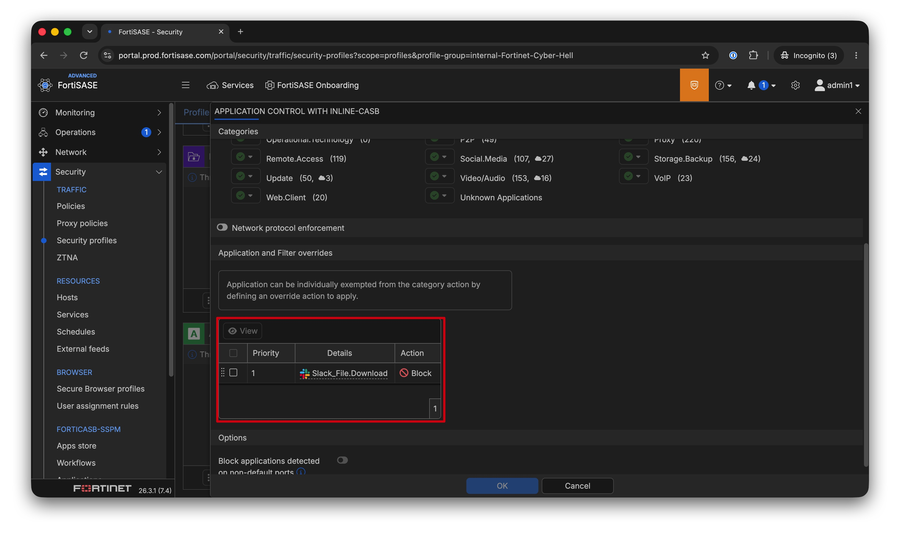
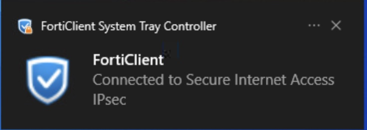
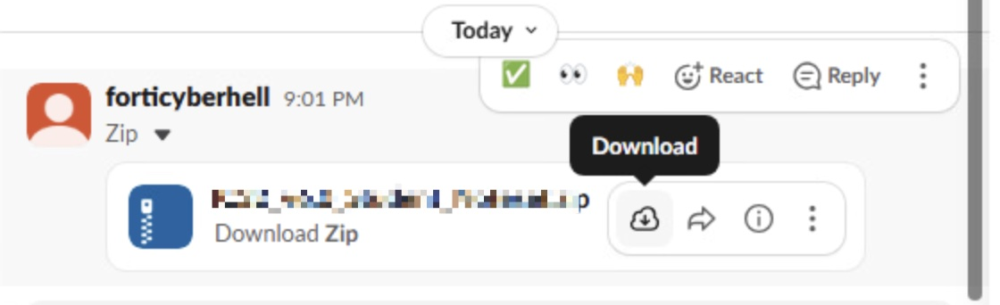
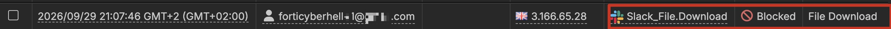
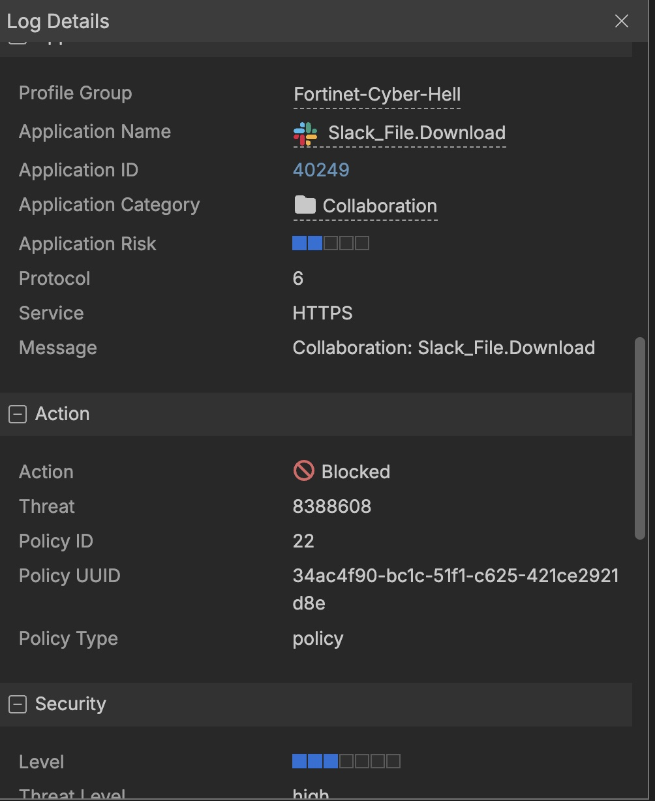

 

Defender

FortiSASE (Secure Access Service Edge) is Fortinet’s cloud-delivered networking and security platform. It unifies **SD-WAN** with key security services such as **firewall-as-a-service**, **secure web gateway**, **CASB**, and **Zero Trust Network Access** (ZTNA). This allows organizations to give users secure, reliable access to applications and data whether they are in the **office**, at **home**, or on the **road**.

 

FortiSASE is fully cloud managed (although Fortinet now also offers Sovereign SASE which can be hosted in your own datacentres). So, in order to change the configuration, we will first login on FortiCloud.

 

Go to 
[FortiSASE portal login](https://portal.prod.fortisase.com/login) 
(You can also access this console from within your own browser.)

 

There, you can choose **Log in with FortiCloud SSO** with the following credentials
* IAM Account
* Account ID: 31952
* Username: adminX
* Password: Exclusive123!

 

You will get an e-mail with your MFA token in FortiCyberhell's Outlook mailbox. Please look out for your number. It will be in the form of forticyberhell+X@outlook.com. Make sure to match the number, otherwise the MFA code won't work.

Once you have logged in, you will see the following dashboard

 

Slack is a SaaS application so we will have to look at **Secure Internet Access**.

SIA (Secure Internet Access) secures user traffic to the internet and SaaS applications by applying FortiSASE security services such as SWG, NGFW, IPS and DLP. SPA (Secure Private Access) provides secure, identity- and context-based access to private applications using ZTNA, without exposing the internal network or relying on traditional VPN access.

Let's first start with looking at the profile. FortiSASE also works profile based. So this means we first need to make the profile and afterwards assign it to the policies.

Make sure you have selected the correct profile. We will be working in the Cyberhell profile

Since our first job is trying to block the downloading file via Slack, we need to look at CASB.

Once we would open this, we will see that there is already a block on slack file download

Now we see that the profile is already configured (please take your time to go through the rest of the profile), we can start making our policies.

Head over to the policy section of FortiSASE

Now you have to create your own policy. These policies will be user specific.

Configure the policy like the following:
* Policy name, make sure it includes your user number
* User: Change this to forticyberhell+X@outlook.com 
* Action: Accept
* Profile Group: Fortinet-Cyber-Hell

Once your policy has been created, you will see that it has been added to the bottom. However FortiSASE looks top-to-bottom.

Problem here is that the default allow policy is above is, so our newly created policy would never be used.

Drag and drop this policy to the very top. It doesn't matter that there is another student policy above yours, you just need to be above the default allow policy.

Now head to the IT workstation. Before we can try it, we need to connect our FortiClient to the SIA vpn.

Inside the icon, click on the FortiClient icon. Do no confuse it with the FortiEDR icon. Both clients are installed but it is FortiClient that will connect to FortiSASE.

Click on the icon and open FortiClient. 

Inside the client you can head over to Remote Access

Now click connect

Now you need to fill in your credentials. Make sure it matches your user number and also the number you choose in the firewall policy. 

* User name: forticyberhell+x@outlook.com
* Password: Look in the credentials page 

If it gives a timeout the first time, please try it a second time.
Once it has been connected, you will see a pop-up that the VPN is connected.

You can also go inside FortiClient and you will see that it has been connected. And that there will be traffic going through FortiSASE.

Now it's time to see if the configuration has worked. Go to slack and see if you can still download the file.

You will see that the file won't be downloaded. Since it's an application, FortiSASE is not able to present you with a block page but the file will not be downloaded.

Also let's verify this in the logs. In FortiSASE head over to the security logs.

Inside the **application control with inline CASB logs**, you will see that there is a log saying that the download of the file was blocked.

If you open the details you will see in more detailed what happened, which profile group was hit and a lot more information

    
CHALLENGE

    <!-- CHALLENGE-->

Which FortiSASE application-control signature is responsible for detecting and blocking the file download from Slack?
    

